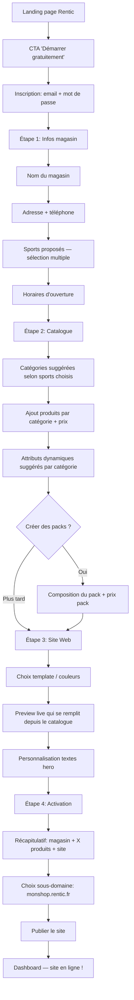
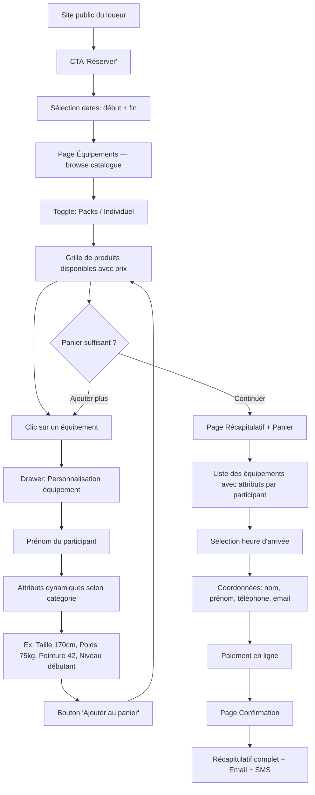
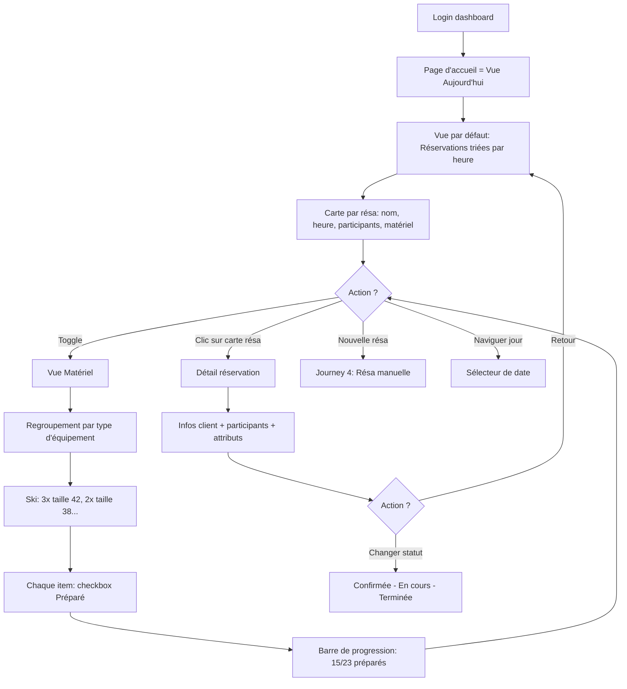
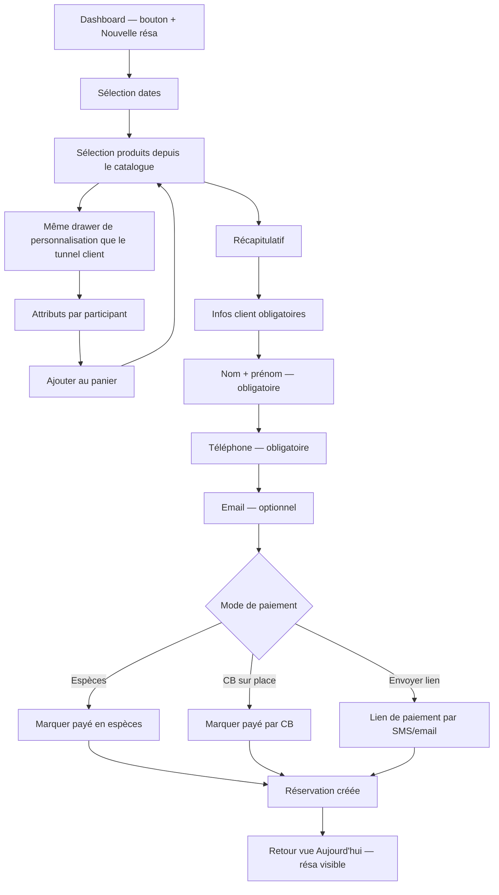

# UX Design Specification Rentic

**Author:** Romain
**Date:** 2026-03-05

---

## Executive Summary

### Project Vision

Rentic est une plateforme SaaS B2B2C pour les loueurs saisonniers d'équipements sportifs en France (~300 TPE). Le produit sert 3 audiences : les loueurs (dashboard de gestion + website builder), les clients finaux (site public + tunnel de réservation), et l'admin Rentic (monitoring). Le défi UX central est de rendre un outil puissant (attributs dynamiques, packs, multi-sport) accessible à des TPE non-tech qui gèrent aujourd'hui avec Excel et un cahier.

L'app Bubble existante (rentic-65966) fournit un référentiel UX validé : sidebar flottante, CRUD 4 onglets pour les réservations, website builder avec prévisualisation live, tunnel de réservation avec toggle packs/individuel. Ces patterns sont conservés et améliorés.

### Target Users

**Loueurs (B2B) — Utilisateurs primaires**
- TPE 1-5 personnes, pas tech-savvy, 30-50 ans
- Gèrent avec Excel/papier/téléphone, 70% des locations encore sur place
- Utilisent le dashboard en desktop au magasin ET en mobile pour vérifier les résas du jour
- Besoin : simplicité absolue, résultat visible rapidement, zéro formation
- Moment clé : voir la première réservation en ligne apparaître dans le dashboard

**Clients finaux (B2C) — Utilisateurs secondaires**
- Vacanciers, familles, 25-45 ans, réservent depuis mobile (canapé, transport)
- Attente : tunnel de réservation fluide, paiement rapide, confirmation immédiate
- Contexte : souvent en préparation de vacances, comparent plusieurs options

**Employés saisonniers — Utilisateurs opérationnels**
- 18-25 ans, premier emploi, tech-native mais sans formation sur l'outil
- Besoin : interface intuitive, autonomie en 1 jour, accès limité aux sections nécessaires

### Key Design Challenges

1. **Dual-device pour les loueurs** : Dashboard responsive desktop + vue mobile opérationnelle simplifiée (résas du jour, changements de statut, stock rapide)
2. **Onboarding 15 min pour non-tech** : Wizard ultra-guidé avec defaults intelligents pour configurer catalogue, attributs, packs et site web
3. **Attributs dynamiques accessibles** : Rendre le système catégories/attributs intuitif sans jargon technique ("Quelles infos avez-vous besoin de vos clients pour cette catégorie ?")
4. **Tunnel de réservation mobile-first** : Packs + participants + attributs dynamiques + paiement sur 320px, chaque étape limpide

### Design Opportunities

1. **Design chaleureux et illustré** : Différenciation émotionnelle vs concurrents froids/corporate — design coloré, illustrations, ton humain adapté aux TPE
2. **Vue préparation matériel** : Killer feature — le loueur ouvre son app le matin et voit les résas du jour avec tailles/poids/pointures pré-remplies, matériel prêt avant l'arrivée du client
3. **Website builder avec preview live** : Validé dans Bubble, différenciateur fort — le loueur voit son site se construire en temps réel
4. **Mobile dashboard simplifié** : Vue "aujourd'hui" pour le magasin — résas du jour, statuts, stock rapide. L'essentiel opérationnel, pas le dashboard complet

## Core User Experience

### Defining Experience

**Loueur — Boucle quotidienne**
L'interaction centrale du loueur se résume à un rituel matinal : ouvrir Rentic et voir immédiatement les réservations du jour, triées par heure d'arrivée, avec le matériel à préparer pour chaque client (tailles, poids, pointures). Le loueur prépare son stock AVANT l'arrivée des clients. C'est le moment où Rentic remplace Excel/papier et prouve sa valeur.

Boucle secondaire : le loueur gère aussi les walk-ins — il crée une réservation manuelle depuis le back-office (FR19) avec paiement en espèces (FR32) ou CB, exactement comme pour une réservation en ligne.

**Client — Tunnel de réservation**
L'interaction critique côté client : trouver le bon équipement, sélectionner dates/participants/attributs, payer — en moins de 5 minutes depuis un mobile. Le client reçoit une confirmation immédiate avec l'heure de retrait choisie.

**Loueur — Onboarding initial**
Le premier contact avec Rentic : un wizard de 15 minutes qui configure le catalogue, les attributs dynamiques, les packs et génère automatiquement le site web à partir du catalogue. Le loueur voit son site se construire en temps réel.

### Platform Strategy

| Audience | Plateforme | Contexte d'usage | Approche |
|----------|-----------|-------------------|----------|
| Loueur (desktop) | Web responsive | Au magasin, écran fixe | Dashboard complet — catalogue, résas, stats, website builder, paramètres |
| Loueur (mobile) | Web responsive | En déplacement, vérification rapide | Vue simplifiée "Aujourd'hui" — résas du jour triées par heure d'arrivée, changements de statut, stock rapide |
| Client final | Web mobile-first | Canapé, transport, préparation vacances | Tunnel de réservation optimisé 320px, site public du loueur |
| Employé | Web responsive | Au magasin, comptoir | Accès limité — résas, statuts, préparation matériel |
| Admin Rentic | Web desktop | Bureau | Dashboard monitoring, gestion abonnements |

**MVP = 100% online.** Pas d'app native, pas d'offline. Web responsive couvre tous les cas.

### Effortless Interactions

1. **Site web auto-généré depuis le catalogue** — Le loueur configure son catalogue (catégories, produits, attributs, packs) et son site web se pré-remplit automatiquement. Pas de double saisie, pas de configuration web séparée.

2. **Vue préparation triée par heure d'arrivée** — Le matin, le loueur ouvre Rentic et voit ses résas du jour classées chronologiquement par heure d'arrivée indiquée par le client. Pour chaque résa : nom, heure, liste du matériel avec attributs (taille 42, poids 75kg, niveau débutant). Il prépare dans l'ordre.

3. **Attributs dynamiques sans jargon** — Au lieu de "configurez vos attributs de catégorie", le système demande : "Quelles infos avez-vous besoin de vos clients pour [catégorie] ?" avec des suggestions contextuelles (ski → taille, poids, pointure, niveau).

4. **Tunnel de réservation en 3-4 étapes** — Dates → Équipements (individuel ou pack) → Participants + attributs → Paiement. Chaque étape tient sur un écran mobile sans scroll excessif.

5. **Réservation manuelle en 2 clics** — Pour les walk-ins, le loueur crée une réservation depuis le back-office avec un parcours simplifié : sélection produits → infos client → encaissement (espèces ou CB).

### Critical Success Moments

| Moment | Audience | Pourquoi c'est critique | Indicateur de succès |
|--------|----------|------------------------|---------------------|
| **Première réservation en ligne** | Loueur | Le moment "aha" — Rentic fonctionne, un client a réservé sans téléphone | Notification visible, résa apparaît dans le dashboard |
| **Matériel préparé avant l'arrivée** | Loueur | La killer feature — le client arrive, tout est prêt, classé par ordre d'arrivée | Vue préparation complète avec attributs pré-remplis |
| **Onboarding ≤ 15 min** | Loueur | Si c'est trop long ou complexe, le loueur abandonne | Catalogue + site web fonctionnel en 15 min |
| **Réservation complète < 5 min** | Client | Si le tunnel est trop long, le client appelle ou va ailleurs | Paiement confirmé, confirmation reçue |
| **Site web généré automatiquement** | Loueur | Le loueur voit son site se construire — effet "wahou" immédiat | Preview live qui se met à jour en temps réel |
| **Autonomie employé en 1 jour** | Employé | Saisonnier qui doit être opérationnel sans formation | Navigation intuitive, accès limité aux sections nécessaires |

### Experience Principles

1. **Prêt avant l'arrivée** — Chaque décision de design doit faciliter la préparation matériel. L'information la plus importante est : qui arrive quand, avec quel besoin, quel matériel préparer.

2. **Zéro double saisie** — Si une donnée existe dans le système, elle se propage partout. Le catalogue alimente le site web, les attributs du catalogue pré-remplissent le tunnel de réservation, les infos client alimentent la vue préparation.

3. **Mobile = l'essentiel, pas le complet** — La version mobile du dashboard ne reproduit pas le desktop. Elle montre uniquement : résas du jour (triées par heure), changements de statut rapides, stock disponible.

4. **Chaleur et clarté** — Design illustré, ton humain, pas de jargon technique. Le loueur doit se sentir accompagné, pas face à un logiciel. Les messages d'erreur sont des solutions, pas des codes.

5. **Résultat visible immédiatement** — Chaque action du loueur produit un résultat visuel immédiat : ajout d'un produit → preview du site se met à jour, réservation créée → compteur de résas change, statut modifié → la ligne se met à jour.

## Desired Emotional Response

### Primary Emotional Goals

**Loueur — "Enfin un outil qui travaille pour moi"**
- **Soulagement et contrôle** — Le loueur passe d'Excel/papier à un système qui organise tout. Il ne court plus après l'info, l'info vient à lui. Sentiment dominant : "je maîtrise ma journée avant qu'elle commence."
- **Fierté** — Son site est professionnel, ses clients réservent en ligne comme chez les grands. Il montre son site à ses collègues loueurs avec fierté.
- **Confiance** — Zéro doute sur les résas du jour, le matériel à préparer, les paiements reçus. Tout est visible, rien ne tombe entre les mailles.

**Client final — "C'était facile, vivement les vacances"**
- **Simplicité** — Le tunnel de réservation est rapide, sans friction. Le client ne se pose pas de questions.
- **Confiance** — Confirmation immédiate, récapitulatif clair, heure de retrait confirmée. Le client sait que tout est en ordre.
- **Anticipation positive** — La réservation s'inscrit dans la préparation des vacances, un moment agréable.

**Employé — "Je gère, pas besoin qu'on m'explique"**
- **Autonomie** — L'interface est suffisamment intuitive pour être opérationnel en 1 jour sans formation.
- **Compétence** — L'employé se sent capable, pas limité par l'outil.

### Emotional Journey Mapping

| Étape | Loueur | Client |
|-------|--------|--------|
| **Découverte** | Curiosité → "ça a l'air simple et fait pour moi" | Confiance → "ce site est pro et clair" |
| **Onboarding** | Satisfaction progressive → "ça prend forme, c'est rapide" | — |
| **Première résa reçue** | Excitation → "ça marche ! Un client a réservé" | Soulagement → "c'est réservé, c'est réglé" |
| **Usage quotidien** | Sérénité → "tout est prêt, je sais quoi faire" | — |
| **Erreur / problème** | Accompagnement → "le système m'explique quoi faire" | Réassurance → "ma réservation est toujours valide" |
| **Retour régulier** | Habitude confortable → "c'est mon outil de travail" | — |

### Micro-Emotions

**Confiance vs Doute** — Critique. Chaque action doit produire un feedback clair : confirmation visuelle, message de succès, état mis à jour. Le loueur non-tech ne doit jamais se demander "est-ce que ça a marché ?".

**Accomplissement vs Frustration** — Clé pendant l'onboarding. Chaque étape du wizard doit donner un résultat visible (preview du site, aperçu du catalogue) pour maintenir la motivation.

**Chaleur vs Solitude** — Le ton de l'interface accompagne : messages humains, suggestions contextuelles, pas de jargon. Le loueur se sent guidé, pas abandonné face à un logiciel froid.

**Excitation vs Anxiété** — La première réservation en ligne est un moment d'excitation, pas de stress. Notification claire, détails visibles, action suivante évidente.

### Design Implications

| Émotion visée | Implication UX |
|--------------|----------------|
| **Soulagement / contrôle** | Vue préparation du jour en page d'accueil, triée par heure. Pas besoin de chercher — l'essentiel est là |
| **Fierté** | Website builder avec preview live, résultat visuel immédiat et professionnel |
| **Confiance** | Feedback systématique sur chaque action (toast, animation, changement de statut visible). Jamais d'état ambigu |
| **Simplicité** | Tunnel de réservation linéaire, une question par étape, progression visible |
| **Accompagnement** | Messages d'erreur = solutions ("Votre catalogue est vide → Ajoutez votre premier produit"). Ton humain, jamais de codes techniques |
| **Anticipation** | Email/SMS de confirmation avec récapitulatif complet, heure de retrait, adresse du magasin |

### Emotional Design Principles

1. **Feedback immédiat, toujours** — Chaque clic produit une réponse visuelle en < 300ms. Pas d'écran blanc, pas d'état indéterminé. Le loueur non-tech a besoin de voir que ça fonctionne.

2. **Célébrer les victoires** — Première réservation, 10e réservation, premier mois complet : marquer ces moments avec des micro-animations ou messages de félicitation. Le loueur construit sa confiance pas à pas.

3. **Erreur = aide, jamais reproche** — Les messages d'erreur sont des guides : "Il manque une photo pour votre produit → Ajouter une photo". Ton bienveillant, action claire, jamais de jargon.

4. **Progressivité** — L'onboarding montre le résultat à chaque étape. Le loueur voit son catalogue se remplir, son site se construire. La motivation vient du résultat visible, pas de la promesse.

5. **Chaleur dans les détails** — Illustrations plutôt qu'icônes froides, couleurs chaudes, micro-copy humain ("Prêt pour la journée ?" plutôt que "Dashboard"). La différenciation émotionnelle passe par les détails.

## UX Pattern Analysis & Inspiration

### Inspiring Products Analysis

**Doctolib — Référence réservation pour les loueurs**
- Le loueur connaît Doctolib en tant que patient : créneaux disponibles, sélection en 3 clics, confirmation immédiate
- Pattern clé : **disponibilité visuelle instantanée** — le client voit ce qui est dispo sans chercher
- Onboarding praticien : wizard pas-à-pas qui configure le profil et les disponibilités. Résultat visible rapidement
- Feedback systématique : confirmation SMS/email, rappels, statuts clairs

**Airbnb — Référence tunnel de réservation**
- Recherche → dates → détails → paiement : tunnel linéaire sans retour arrière forcé
- Pattern clé : **récapitulatif toujours visible** — le client sait en permanence ce qu'il réserve et le prix total
- Dashboard hôte : vue "Aujourd'hui" avec les arrivées/départs du jour, statuts visuels
- Gestion des messages et des statuts de réservation dans une interface unifiée

**Decathlon Location — Référence sélection équipement**
- Sélection sport → catégorie → tailles/attributs → panier : flow adapté à l'équipement sportif
- Pattern clé : **attributs contextuels par sport** — les questions posées dépendent du type d'équipement
- Visualisation produit avec les options disponibles clairement affichées

**App Bubble Rentic (existante) — Référence validée**
- Sidebar flottante avec navigation claire entre sections (Réservations, Catalogue, Site Web, Paramètres)
- CRUD réservations avec 4 onglets (À venir, En cours, Terminées, Annulées)
- Website builder avec prévisualisation live côte-à-côte
- Tunnel de réservation avec toggle Packs / Individuel
- Ces patterns sont validés par l'usage réel et constituent le socle UX à conserver

### Transferable UX Patterns

**Navigation & Structure**

| Pattern | Source | Application Rentic |
|---------|--------|--------------------|
| Sidebar flottante avec sections | Bubble Rentic | Conserver — navigation principale du dashboard loueur |
| Vue "Aujourd'hui" en page d'accueil | Airbnb hôte | Adapter — résas du jour triées par heure d'arrivée avec matériel à préparer |
| Onglets de statut sur les listes | Bubble Rentic | Conserver — À venir / En cours / Terminées / Annulées |

**Réservation & Tunnel**

| Pattern | Source | Application Rentic |
|---------|--------|--------------------|
| Tunnel linéaire étape par étape | Airbnb | Adopter — Dates → Équipements → Participants + attributs → Paiement |
| Récapitulatif flottant toujours visible | Airbnb | Adopter — prix total et détails visibles à chaque étape du tunnel |
| Attributs contextuels par catégorie | Decathlon | Adopter — ski demande taille/poids/pointure, paddle demande taille/poids |
| Toggle Packs / Individuel | Bubble Rentic | Conserver — le client choisit son mode de réservation |
| Créneaux horaires disponibles | Doctolib | Adapter — heure d'arrivée sélectionnable par le client |

**Onboarding & Configuration**

| Pattern | Source | Application Rentic |
|---------|--------|--------------------|
| Wizard pas-à-pas avec progression | Doctolib praticien | Adopter — onboarding loueur en étapes avec preview à chaque étape |
| Preview live côte-à-côte | Bubble Rentic | Conserver — website builder avec résultat visible en temps réel |
| Suggestions contextuelles | Decathlon | Adopter — attributs suggérés par sport/catégorie |

**Feedback & Confirmation**

| Pattern | Source | Application Rentic |
|---------|--------|--------------------|
| Confirmation multi-canal (email + SMS) | Doctolib | Adopter — confirmation immédiate au client avec récapitulatif |
| Statuts visuels avec couleurs | Airbnb | Adopter — pastilles de couleur sur les réservations |
| Notification nouvelle réservation | Airbnb hôte | Adopter — alerte visible quand une résa en ligne arrive |

### Anti-Patterns to Avoid

1. **Dashboard surchargé type ERP** — Trop de métriques, graphiques et options dès la page d'accueil. Le loueur non-tech se noie. → La page d'accueil = vue préparation du jour, pas un tableau de bord analytique.

2. **Formulaires longs sur une seule page** — Tout afficher en une fois (dates + produits + participants + attributs + paiement). → Tunnel découpé en étapes, une question principale par écran.

3. **Jargon technique dans l'interface** — "Attributs dynamiques", "Catégories parentes", "Slot de disponibilité". → Langage humain : "Quelles infos avez-vous besoin ?", "Choisissez vos dates".

4. **Configuration avant résultat** — Demander au loueur de tout configurer (horaires, CGV, couleurs) avant de voir quoi que ce soit. → Montrer un résultat (site web preview) le plus tôt possible dans l'onboarding.

5. **Mobile = desktop compressé** — Reproduire toutes les fonctionnalités desktop sur mobile avec des menus hamburger profonds. → Mobile = vue opérationnelle simplifiée (résas du jour, statuts, stock).

6. **Absence de feedback** — Actions sans confirmation visuelle, états ambigus, boutons qui ne réagissent pas. → Feedback immédiat sur chaque action (< 300ms).

### Design Inspiration Strategy

**Adopter tel quel :**
- Tunnel linéaire Airbnb (étape par étape, récapitulatif flottant)
- Confirmation multi-canal Doctolib (email + SMS immédiat)
- Statuts visuels avec couleurs (pastilles Airbnb)

**Adapter au contexte Rentic :**
- Vue "Aujourd'hui" Airbnb → enrichir avec le matériel à préparer par heure d'arrivée (killer feature)
- Wizard Doctolib praticien → ajouter la preview live du site web à chaque étape
- Attributs Decathlon → système de suggestions par catégorie de sport, pas de configuration manuelle complexe
- Créneaux Doctolib → adaptation en sélection d'heure d'arrivée (pas de "créneaux" au sens médical)

**Conserver de l'app Bubble :**
- Sidebar flottante, CRUD 4 onglets, toggle Packs/Individuel, website builder avec preview live
- Ces patterns sont validés par l'usage et forment l'ADN UX de Rentic

**Éviter :**
- Dashboards type ERP/corporate surchargés
- Mobile = copie du desktop compressée
- Configuration longue avant tout résultat visible
- Jargon technique dans l'interface

## Design System Foundation

### Design System Choice

**shadcn/ui** — Système thémable basé sur Radix UI + Tailwind CSS, natif Next.js.

Modèle copy-paste : les composants sont copiés dans le projet (`/components/ui/`), pas importés depuis un package externe. Contrôle total sur chaque composant, aucune dépendance rigide.

### Rationale for Selection

| Critère | Évaluation |
|---------|-----------|
| **Intégration Next.js 15** | Natif — construit pour React Server Components et App Router |
| **Personnalisation** | Totale — composants dans le projet, modifiables à volonté |
| **Accessibilité** | Radix UI fournit les primitives ARIA, keyboard navigation, focus management |
| **Theming** | Tailwind CSS — design tokens via CSS variables, palette personnalisable |
| **Vitesse MVP** | Rapide — composants prêts (Button, Dialog, Table, Form, Select, etc.) |
| **Design chaleureux** | Base neutre, entièrement thémable — pas de style imposé comme Material/Ant |
| **Communauté** | Très active, documentation complète, écosystème riche |
| **Poids** | Léger — pas de runtime CSS-in-JS, tree-shaking natif |

**Alternatives écartées :**
- Material UI (MUI) — Style "Google" difficile à rendre chaleureux, bundle plus lourd, runtime CSS-in-JS
- Ant Design — Orienté enterprise/ERP, opposé du style recherché pour des TPE
- Custom from scratch — Trop lent pour un MVP, risque de dette UX et d'incohérences

### Implementation Approach

**Structure composants :**
- `/components/ui/` — Composants shadcn/ui de base (Button, Input, Dialog, Table, Select, etc.)
- `/components/` — Composants métier Rentic construits sur les composants ui (ReservationCard, ProductForm, etc.)

**Design tokens via Tailwind :**
- Couleurs : palette chaude personnalisée (primary, secondary, accent, success, warning, error)
- Typographie : font-family accueillante, tailles cohérentes
- Espacement : scale aéré, généreux pour la lisibilité
- Border-radius : généreux (8-12px) pour un aspect doux et moderne
- Ombres : douces et subtiles, pas de contrastes durs

**Composants shadcn/ui à utiliser :**
- Layout : Sidebar, Sheet (mobile), Tabs, Card
- Forms : Input, Select, DatePicker, Checkbox, Switch, Textarea
- Data : Table, Badge, Avatar
- Feedback : Toast, Alert, Dialog, Progress
- Navigation : Breadcrumb, Pagination, Command

### Customization Strategy

**Différenciation visuelle (au-delà des composants de base) :**

1. **Palette chaude** — Remplacer les gris par défaut par une palette colorée et chaleureuse. Couleurs de marque Rentic en primary, tons terreux/naturels en secondary (évoquant le sport outdoor)

2. **Illustrations custom** — États vides ("Pas encore de réservation — ça va venir !"), onboarding (illustration à chaque étape du wizard), succès (confetti/animation à la première résa), erreurs (illustration bienveillante + solution)

3. **Micro-copy intégré** — Chaque composant porte un ton humain : placeholders descriptifs, labels en langage courant, messages d'aide contextuels

4. **Micro-animations** — Transitions fluides sur les changements de statut, feedback visuel sur les actions (bouton → loading → succès), animations subtiles d'entrée sur les listes

5. **Responsive adaptatif** — Les composants s'adaptent au contexte : Table complète en desktop → Cards empilées en mobile, Sidebar → Bottom navigation en mobile

## Defining Core Experience

### Defining Experience

**Pour le loueur : "J'ouvre Rentic le matin, tout est prêt"**

Le loueur arrive au magasin, ouvre Rentic, et sa journée est organisée. Deux vues complémentaires avec un toggle :

- **Vue Réservations** — Résas du jour triées par heure d'arrivée. Pour chaque résa : nom du client, heure d'arrivée, liste du matériel avec attributs (taille, poids, pointure, niveau). Le loueur sait qui arrive quand et ce qu'il faut.

- **Vue Matériel** — Le même stock à préparer, mais regroupé par type d'équipement et attributs. "3 paires de ski taille 42", "2 chaussures 38", "1 snowboard 155cm". Le loueur prépare par lot — plus rapide, plus efficace. Chaque item est lié à sa réservation pour traçabilité.

**Le toggle Vue Réservations ↔ Vue Matériel** est l'interaction signature de Rentic. C'est ce que le loueur montrera à un collègue : "Regarde, le matin j'ouvre ça et tout est prêt."

**Pour le client : "J'ai réservé mon matos en 3 minutes"**

Le vacancier trouve le site du loueur, choisit ses dates, sélectionne son équipement (individuel ou pack), remplit les attributs par participant, choisit son heure d'arrivée, paie — et c'est fait. Confirmation immédiate, récapitulatif complet, matériel prêt à l'arrivée.

### User Mental Model

**Loueur — Modèle mental actuel :**
- Le soir : recopie les réservations du lendemain depuis les appels/emails/papier, essaie d'anticiper
- Le matin : improvise en fonction de qui arrive, cherche les infos (taille ? pointure ?), prépare au fil de l'eau
- Résultat : stress, oublis, clients qui attendent

**Loueur — Modèle mental Rentic :**
- Le matin : ouvre Rentic → tout est là, trié, avec les attributs. Toggle matériel pour préparer par lot
- Le client arrive : le matériel est prêt, le loueur n'a plus qu'à remettre
- Résultat : sérénité, professionnalisme, clients impressionnés

**Client — Modèle mental actuel :**
- Appelle le loueur (souvent pas de réponse), passe sur place en arrivant (risque de rupture), envoie un email (réponse en 24-48h)
- Incertitude : "est-ce qu'il y aura du stock ? est-ce qu'il a noté ma taille ?"

**Client — Modèle mental Rentic :**
- Réserve en ligne en 3 minutes, comme un Airbnb ou un Doctolib
- Certitude : confirmation immédiate, heure de retrait, matériel garanti

### Success Criteria

| Critère | Indicateur |
|---------|-----------|
| **Le loueur comprend la vue préparation en < 10s** | Pas besoin d'explication — les résas du jour sont visibles immédiatement |
| **Le toggle Réservations ↔ Matériel est découvert naturellement** | Le loueur bascule de lui-même, sans tutoriel |
| **La préparation par lot est plus rapide** | Vue matériel regroupe logiquement : type → attribut → quantité |
| **Le client réserve en < 5 min** | Du choix de dates au paiement confirmé |
| **Zéro appel "est-ce que c'est réservé ?"** | Confirmation immédiate multi-canal (email + SMS) |
| **Le loueur dit "c'est prêt" avant l'arrivée du client** | Matériel préparé grâce à la vue matériel + heure d'arrivée |

### Novel UX Patterns

**Pattern innovant : Toggle Vue Réservations ↔ Vue Matériel**
- Pas un pattern standard dans les SaaS de réservation existants
- Combine des patterns établis (liste + toggle + regroupement) de manière nouvelle
- Métaphore familière : comme un toggle "Liste / Grille" mais appliqué à deux angles de lecture des mêmes données
- Pas besoin d'éducation spécifique — le toggle est un pattern universel compris par tous
- Différenciateur fort face aux concurrents qui n'offrent qu'une vue réservation

**Patterns établis réutilisés :**
- Tunnel de réservation linéaire (Airbnb/Doctolib) — pas d'innovation nécessaire
- Sélection d'heure d'arrivée (Doctolib créneaux) — adaptation directe
- Confirmation multi-canal email + SMS — pattern standard
- Sidebar + onglets de statut — validé dans l'app Bubble

### Experience Mechanics

**Vue Préparation du Jour (Loueur)**

**1. Initiation :**
- Le loueur ouvre Rentic → la page d'accueil EST la vue préparation du jour
- Pas de navigation, pas de clic — c'est la première chose qu'il voit
- Date du jour sélectionnée par défaut, possibilité de naviguer aux jours suivants

**2. Interaction — Vue Réservations :**
- Liste triée par heure d'arrivée
- Chaque carte réservation : nom client, heure, statut (confirmée/en attente), nombre de participants, liste matériel avec attributs
- Clic sur une carte → détail complet de la réservation
- Actions rapides : changer le statut (Confirmée → En cours → Terminée)

**3. Interaction — Vue Matériel (toggle) :**
- Même données, vue regroupée par type d'équipement
- Sections : "Ski" (3× taille 42, 2× taille 38), "Chaussures" (3× pointure 42, 2× pointure 38), "Snowboard" (1× 155cm)
- Chaque item indique la réservation associée et l'heure d'arrivée
- Possibilité de cocher "préparé" pour tracker l'avancement

**4. Feedback :**
- Compteur en haut : "8 réservations aujourd'hui — 23 équipements à préparer"
- Progression : "15/23 préparés" avec barre de progression
- Notification en temps réel quand une nouvelle résa arrive

**5. Completion :**
- Tous les équipements cochés "préparé" → message "Tout est prêt pour la journée !"
- Au fil de la journée : les résas passent en "En cours" puis "Terminée"

**Tunnel de Réservation (Client)**

**1. Initiation :**
- Le client arrive sur le site public du loueur → CTA "Réserver" visible
- Sélection des dates (calendrier avec disponibilités visibles)

**2. Interaction :**
- Étape 1 : Dates de location (date début + date fin)
- Étape 2 : Choix équipement — toggle Pack / Individuel. Sélection des produits avec quantités
- Étape 3 : Participants — pour chaque participant, attributs dynamiques selon la catégorie (taille, poids, pointure, niveau)
- Étape 4 : Heure d'arrivée + coordonnées + paiement
- Récapitulatif flottant visible à chaque étape (prix total, dates, produits sélectionnés)

**3. Feedback :**
- Progression visible (étape 2/4)
- Validation en temps réel des champs
- Prix qui se met à jour dynamiquement

**4. Completion :**
- Page de confirmation avec récapitulatif complet
- Email + SMS de confirmation immédiats
- Informations pratiques : adresse du magasin, heure de retrait, contact du loueur

## Visual Design Foundation

### Color System

**Palette de marque existante :**
- Logo Rentic : icône bleue + texte "Rentic"
- Couleur primaire actuelle : bleu indigo (~#5B6CF0)

**Stratégie couleur : Bleu + accents chauds**

| Token | Rôle | Direction | Usage |
|-------|------|-----------|-------|
| `primary` | Action principale, navigation, CTA | Bleu indigo existant (~#5B6CF0) | Boutons primaires, liens, sidebar active, focus states |
| `primary-foreground` | Texte sur primary | Blanc | Texte des boutons primaires |
| `secondary` | Actions secondaires, surfaces | Bleu très clair / gris-bleu doux | Cards, badges, surfaces secondaires |
| `accent` | Chaleur, points d'attention | Orange chaud / ambre (~#F59E0B) | Notifications, badges nouveauté, CTA secondaires, éléments de célébration |
| `success` | Confirmations, états positifs | Vert chaud (~#22C55E) | Statut "Confirmée", paiement reçu, matériel préparé |
| `warning` | Alertes modérées | Ambre (~#EAB308) | Stock bas, résa en attente |
| `destructive` | Erreurs, suppressions | Rouge doux (~#EF4444) | Annulations, erreurs de formulaire |
| `muted` | Texte secondaire, bordures | Gris neutre chaud (pas froid) | Texte d'aide, bordures, placeholders |
| `background` | Fond de page | Blanc légèrement chaud (#FAFAF9) | Fond principal dashboard et site public |
| `card` | Fond des cartes | Blanc pur (#FFFFFF) | Cards, modales, surfaces surélevées |

**La chaleur vient de :**
- L'accent orange/ambre qui réchauffe le bleu (notifications, célébrations, badges)
- Le fond légèrement chaud (#FAFAF9 au lieu de #FFFFFF pur)
- Les gris neutres-chauds (pas de gris bleutés froids)
- Les illustrations colorées avec des touches chaudes
- Le vert chaud pour les succès (pas de vert froid/néon)

**Contraste et accessibilité :**
- Tous les textes respectent WCAG AA minimum (4.5:1 pour le texte normal, 3:1 pour le texte large)
- Le bleu primaire sur blanc dépasse 4.5:1
- Les couleurs de statut sont doublées par des icônes (pas de dépendance à la couleur seule)

### Typography System

**Font principale : Bricolage Grotesque**
- Utilisée pour les titres ET le body text (cohérence de marque)
- Font variable avec large gamme de poids (200-800)
- Caractère moderne avec une touche de personnalité — alignée avec le positionnement chaleureux

**Type scale (base 16px) :**

| Token | Taille | Poids | Line-height | Usage |
|-------|--------|-------|-------------|-------|
| `display` | 36px / 2.25rem | 700 | 1.2 | Hero landing page, titres marketing |
| `h1` | 28px / 1.75rem | 700 | 1.3 | Titres de page dashboard |
| `h2` | 22px / 1.375rem | 600 | 1.35 | Titres de section |
| `h3` | 18px / 1.125rem | 600 | 1.4 | Sous-titres, titres de cartes |
| `body` | 16px / 1rem | 400 | 1.5 | Texte principal |
| `body-sm` | 14px / 0.875rem | 400 | 1.5 | Texte secondaire, labels de formulaire |
| `caption` | 12px / 0.75rem | 400 | 1.4 | Texte d'aide, timestamps, badges |

**Font secondaire (optionnel) :**
- Pour les données numériques (prix, compteurs, stats) : font tabular-nums activée sur Bricolage Grotesque ou fallback sur une font monospace système pour l'alignement des chiffres

### Spacing & Layout Foundation

**Base unit : 4px**

| Token | Valeur | Usage |
|-------|--------|-------|
| `space-1` | 4px | Gaps internes minimes (icon + label) |
| `space-2` | 8px | Padding interne composants compacts |
| `space-3` | 12px | Gap entre éléments proches |
| `space-4` | 16px | Padding standard des cartes |
| `space-5` | 20px | Gap entre sections liées |
| `space-6` | 24px | Padding généreux des cartes |
| `space-8` | 32px | Gap entre sections |
| `space-10` | 40px | Espacement de section majeur |
| `space-12` | 48px | Espacement entre blocs de page |

**Border-radius :**

| Token | Valeur | Usage |
|-------|--------|-------|
| `radius-sm` | 6px | Badges, inputs |
| `radius-md` | 8px | Boutons, cartes compactes |
| `radius-lg` | 12px | Cartes principales, modales |
| `radius-xl` | 16px | Conteneurs larges, hero sections |

**Layout :**

| Contexte | Structure |
|----------|-----------|
| **Dashboard desktop** | Sidebar fixe 240px + contenu fluide. Grille 12 colonnes, max-width 1440px |
| **Dashboard mobile** | Bottom navigation + contenu plein écran. Stack vertical, cards pleine largeur |
| **Site public desktop** | Centré max-width 1200px, sections full-width pour le hero |
| **Site public mobile** | Stack vertical, padding 16px latéral, CTA pleine largeur |
| **Tunnel réservation** | Centré max-width 640px + récapitulatif latéral en desktop. Stack vertical en mobile |

**Densité :**
- Dashboard loueur : **compact mais lisible** — tables avec row-height 48px, cards avec padding 16px, espacement fonctionnel
- Site public client : **aéré et spacieux** — sections avec padding 48-64px, texte large, beaucoup de blanc
- Tunnel réservation : **focalisé** — une question par écran, pas de distraction, espacement généreux

### Accessibility Considerations

- **Contraste** : WCAG AA minimum sur tous les textes. Le bleu primaire (#5B6CF0) sur fond blanc respecte 4.5:1
- **Couleur non-suffisante** : Tous les statuts (confirmée, en attente, annulée) utilisent couleur + icône + label texte
- **Touch targets** : Minimum 44×44px pour tous les éléments interactifs (mobile)
- **Focus visible** : Ring de focus visible sur tous les éléments interactifs (keyboard navigation)
- **Font size minimum** : 14px pour le texte lisible, 12px uniquement pour les éléments tertiaires (timestamps, badges)
- **Responsive text** : Les tailles s'adaptent au viewport (clamp() ou media queries)

## Design Direction Decision

### Design Directions Explored

6 directions visuelles explorées via le fichier `ux-design-directions.html`, toutes basées sur la même fondation (bleu indigo, Bricolage Grotesque, accents chauds) mais avec des approches différentes :

1. **Clean Minimal** — Sobre, bordures fines, professionnel
2. **Warm Bold** — Sidebar sombre, gradients colorés, contrasté
3. **Soft Rounded** — Radius généreux, ombres douces, accueillant
4. **Data-Dense Modern** — Sidebar icônes, tableau compact, efficace
5. **Card Grid** — Top-nav, grille de cards, visuel
6. **Vue Matériel** — Toggle matériel, regroupé par type, cochable

### Chosen Direction

**Direction 3 — Soft Rounded**

Style visuel caractérisé par :
- **Border-radius généreux (16px)** sur les cards, modales et conteneurs — aspect doux et moderne
- **Ombres douces** (0 2px 12px rgba(0,0,0,0.04)) — profondeur subtile sans contraste dur
- **Fond lavande très léger** (#F8F7FF) — chaleur sans être coloré, différenciation douce du blanc pur
- **Cards avec hover effect** — micro-interaction qui donne vie à l'interface (translateY -1px + ombre renforcée)
- **Barre de progression visible** — élément fort de la préparation quotidienne (15/23 préparés)
- **Sidebar avec nav items arrondis** (radius 12px) — navigation douce, pas de bords durs
- **Toggle avec état actif blanc + ombre** — discret mais clair, pas de couleur agressive sur le toggle
- **Badges arrondis (16px)** — statuts visuels doux (Confirmée en vert, En attente en ambre)

### Design Rationale

| Critère | Évaluation |
|---------|-----------|
| **Alignement émotionnel** | Le style doux et arrondi évoque l'accompagnement, pas la complexité. Le loueur non-tech se sent accueilli, pas face à un ERP |
| **Différenciation** | Les concurrents (Lokki, EasyRent) ont des interfaces plates et corporate. Le style soft rounded est distinctif et mémorable |
| **Lisibilité** | Les ombres douces créent une hiérarchie visuelle naturelle sans bordures dures. Les éléments se détachent clairement |
| **Cohérence avec la marque** | Le bleu indigo existant fonctionne parfaitement comme couleur d'accent dans un environnement doux |
| **Scalabilité** | Le système de cards arrondies s'adapte bien à toutes les sections (résas, catalogue, site web, stats) |
| **Mobile** | Les radius généreux et les ombres sont efficaces sur mobile — les touch targets sont naturellement généreux |

### Implementation Approach

**Tokens CSS spécifiques Direction 3 :**

```css
--radius-sm: 8px;      /* inputs, badges */
--radius-md: 12px;     /* boutons, nav items, toggle */
--radius-lg: 16px;     /* cards, modales */
--radius-xl: 20px;     /* conteneurs larges */

--shadow-sm: 0 1px 4px rgba(0,0,0,0.03);
--shadow-md: 0 2px 12px rgba(0,0,0,0.04);
--shadow-lg: 0 4px 16px rgba(0,0,0,0.08);
--shadow-hover: 0 4px 16px rgba(0,0,0,0.08);

--bg-page: #F8F7FF;        /* fond de page lavande */
--bg-card: #FFFFFF;         /* fond des cards */
--bg-sidebar: #FFFFFF;      /* sidebar blanche */
--bg-nav-active: #EEF0FF;   /* nav item actif */
--bg-toggle: #EEEDF5;       /* fond du toggle */
--bg-toggle-active: #FFFFFF; /* toggle actif = blanc + ombre */
```

**Principes d'implémentation :**
- Tous les composants shadcn/ui reçoivent les radius généreux via les CSS variables
- Les cards ont systématiquement un hover effect (translateY + shadow-hover)
- Le fond de page utilise le lavande léger, les cards se détachent en blanc pur
- Les transitions sont à 150ms ease pour la fluidité sans lenteur
- La barre de progression est un élément récurrent dans la vue préparation

**Éléments intégrés des autres directions :**
- Direction 6 (Vue Matériel) — le toggle et la vue matériel regroupée sont intégrés dans le style Direction 3
- Direction 2 (Warm Bold) — les stats colorées avec gradients peuvent être adoptées pour les compteurs principaux
- Direction 3 garde la sidebar classique (pas la grille de Direction 5 ni le tableau de Direction 4)

## User Journey Flows

### Journey 1 : Onboarding Loueur (15 min)

**Objectif :** Le loueur s'inscrit et a un site fonctionnel avec catalogue en 15 minutes.



**Points UX clés :**
- Chaque étape montre le résultat (preview du site se remplit progressivement)
- Les catégories et attributs sont **suggérés** selon les sports choisis (pas de configuration manuelle)
- Les packs sont optionnels ("Plus tard") — pas de blocage
- La preview live est visible dès l'étape 2

### Journey 2 : Tunnel de Réservation Client (< 5 min)

**Objectif :** Le vacancier réserve son équipement en guest, avec personnalisation par équipement via drawer.



**Points UX clés :**
- **Pas de création de compte** — réservation guest
- Pattern **"browse + add to cart"** : le client reste sur la page équipement, ajoute des items via le drawer
- Le drawer se ferme après "Ajouter au panier" → retour à la page équipement pour continuer
- Le **panier flottant** (ou badge) est visible en permanence avec le nombre d'items et le total
- Les **attributs dans le drawer** sont ceux définis par le loueur pour cette catégorie — personnalisés par sport
- Si le client choisit un **pack**, le drawer montre tous les équipements du pack avec les attributs de chaque participant
- L'heure d'arrivée est dans le récapitulatif, pas dans le tunnel — ne pas alourdir le browse

### Journey 3 : Préparation Matériel Quotidienne

**Objectif :** Le loueur ouvre Rentic le matin et prépare tout le matériel avant l'arrivée des clients.



**Points UX clés :**
- La page d'accueil **EST** la vue préparation — pas de navigation nécessaire
- Le **toggle Réservations ↔ Matériel** est l'interaction signature
- La barre de progression motive : "plus que 8 à préparer !"
- Les checkboxes "Préparé" dans la vue matériel permettent de tracker l'avancement
- Le sélecteur de date permet d'anticiper (préparer pour demain le soir)
- Notification en temps réel si une nouvelle résa arrive pendant la préparation

### Journey 4 : Réservation Manuelle (Walk-in)

**Objectif :** Le loueur crée une réservation pour un client qui se présente au magasin.



**Points UX clés :**
- Le flow réutilise le **même drawer de personnalisation** que le tunnel client (cohérence, code partagé)
- Infos client : nom + prénom + téléphone obligatoires, email optionnel (facturation)
- **3 modes de paiement** : espèces, CB sur place, lien de paiement envoyé
- Flow rapide — le loueur a le client devant lui, pas de friction
- La résa apparaît immédiatement dans la vue Aujourd'hui

### Journey Patterns

| Pattern | Utilisé dans | Description |
|---------|-------------|-------------|
| **Drawer de personnalisation** | Tunnel client, Résa manuelle | Popup/drawer pour configurer un équipement avec attributs dynamiques + "Ajouter au panier" |
| **Panier progressif** | Tunnel client, Résa manuelle | Panier visible en permanence, ajout item par item, récapitulatif avant paiement |
| **Toggle vue** | Préparation quotidienne | Bascule entre deux vues des mêmes données (Réservations ↔ Matériel) |
| **Carte réservation** | Préparation, Liste résas | Card avec nom, heure, statut, participants, matériel |
| **Barre de progression** | Préparation, Onboarding | Indicateur visuel d'avancement (X/Y) |
| **Feedback immédiat** | Tous | Toast de confirmation après chaque action, changement visuel de statut |

### Flow Optimization Principles

1. **Zéro navigation morte** — La page d'accueil est utile (vue préparation), l'onboarding commence immédiatement, le tunnel démarre au CTA
2. **Drawer réutilisable** — Le même composant drawer de personnalisation sert dans le tunnel client ET la résa manuelle. Un seul composant à maintenir, UX cohérente
3. **Browse + add to cart > wizard linéaire** — Le client peut ajouter des équipements dans l'ordre qu'il veut, pas forcé dans un parcours rigide
4. **Infos au bon moment** — Les attributs sont demandés dans le drawer (au moment de l'ajout), pas dans une étape séparée qui force à se souvenir
5. **Récupération douce** — Panier persistant en session, le client peut revenir en arrière sans perdre ses choix

## Component Strategy

### Design System Components (shadcn/ui)

**Composants de base utilisés directement :**

| Composant shadcn/ui | Usage Rentic |
|---------------------|-------------|
| `Button` | CTA, actions, submit forms |
| `Input` / `Textarea` | Formulaires (onboarding, infos client, attributs) |
| `Select` | Sélection sport, catégorie, niveau |
| `Checkbox` | "Préparé" dans vue matériel, options |
| `Switch` | Toggle packs/individuel |
| `Dialog` | Confirmations, suppressions |
| `Sheet` | Base du drawer de personnalisation (slide depuis la droite) |
| `Tabs` | Onglets réservations (À venir / En cours / Terminées / Annulées) |
| `Table` | Listes catalogue, réservations complètes |
| `Card` | Base de toutes les cards (résas, matériel, stats) |
| `Badge` | Statuts (Confirmée, En attente, Annulée) |
| `Toast` | Feedback après actions (ajout panier, changement statut) |
| `Progress` | Barre de progression préparation matériel |
| `Calendar` | Sélection dates réservation |
| `Form` | Validation formulaires (onboarding, tunnel, résa manuelle) |
| `Sidebar` | Navigation principale dashboard |
| `Breadcrumb` | Navigation secondaire (Catalogue > Ski > Produit) |
| `Avatar` | Initiales loueur/employé |
| `Separator` | Séparateurs visuels sections |
| `Skeleton` | Loading states |
| `Tooltip` | Aide contextuelle |

### Custom Components

#### EquipmentDrawer

**Purpose :** Personnaliser un équipement avec les attributs dynamiques du participant avant ajout au panier. Composant central du tunnel client ET de la résa manuelle.

**Anatomy :**
- Header : nom du produit + prix + photo
- Section participant : prénom (input)
- Section attributs dynamiques : générés selon la catégorie (taille, poids, pointure, niveau...). Chaque attribut a son type (input number, select, input text) défini par le loueur
- Footer : prix calculé + bouton "Ajouter au panier"

**States :** Default (vide) → Remplissage → Validation (champs requis) → Ajout (animation + fermeture)

**Base shadcn :** `Sheet` (side="right") + `Form` + `Input`/`Select` dynamiques

**Réutilisation :** Tunnel client + Résa manuelle (même composant, contexte différent)

#### ReservationCard

**Purpose :** Afficher une réservation dans la vue Aujourd'hui — scannable en un coup d'oeil.

**Anatomy :**
- Header : nom client + heure d'arrivée (grosse, colorée) + badge statut
- Body : nombre de participants + type (pack ou individuel)
- Equipment list : tags d'équipements avec attributs clés (Ski 170cm, Chaussures 42)
- Actions : clic → détail, swipe/bouton → changer statut

**States :** Confirmée (border vert) → En cours (border bleu) → Terminée (grisée) | En attente (border ambre)

**Variants :** Compact (liste) / Expanded (détail ouvert)

**Base shadcn :** `Card` + `Badge` + layout custom

#### MaterialCard

**Purpose :** Afficher un item à préparer dans la vue Matériel — regroupé par type.

**Anatomy :**
- Attribut principal (ex: "Taille 170cm") — gros, lisible
- Quantité ("1 unité" ou "2 paires")
- Résa associée (nom client + heure)
- Checkbox "Préparé"

**States :** À préparer (default) → Préparé (coché, opacité réduite, vert)

**Base shadcn :** `Card` + `Checkbox`

#### MaterialSection

**Purpose :** Regrouper les MaterialCards par type d'équipement dans la vue Matériel.

**Anatomy :**
- Header : icône + nom du type (Ski, Chaussures, Snowboard) + compteur (9 unités)
- Grid de MaterialCards

**Base shadcn :** Layout custom + icônes

#### DayViewToggle

**Purpose :** Basculer entre Vue Réservations et Vue Matériel — interaction signature de Rentic.

**Anatomy :** Deux boutons dans un conteneur arrondi. L'actif est blanc avec ombre (style Direction 3).

**Base shadcn :** Composant custom basé sur le pattern toggle du design direction. Pas un `Tabs` shadcn (visuellement différent).

#### BookingCart

**Purpose :** Panier flottant visible pendant le browse des équipements dans le tunnel client.

**Anatomy :**
- Badge compteur (nombre d'items)
- Au clic/expand : liste des items ajoutés avec prénom + attributs résumés
- Prix total
- Bouton "Continuer" vers récapitulatif

**States :** Vide (discret) → Items ajoutés (badge visible, animé) → Expanded (liste déroulée)

**Variants :** Desktop = sidebar récapitulatif latéral | Mobile = bouton flottant bottom + drawer

**Base shadcn :** `Sheet` (mobile) / layout fixe (desktop) + `Badge`

#### PreparationHeader

**Purpose :** En-tête de la vue Aujourd'hui avec les stats du jour et la barre de progression.

**Anatomy :**
- Titre + date + greeting ("Prêt pour la journée ?")
- Stats rapides : X réservations, Y équipements, Z préparés
- Barre de progression (Z/Y préparés)
- Sélecteur de date (naviguer aux jours suivants)

**Base shadcn :** `Progress` + layout custom + `Calendar` (popover)

#### OnboardingStep

**Purpose :** Étape du wizard d'onboarding avec preview live.

**Anatomy :**
- Indicateur de progression (étape X/4)
- Titre + description de l'étape
- Contenu du formulaire (variable selon l'étape)
- Preview live du site (panneau latéral en desktop, drawer en mobile)
- Navigation : Précédent / Suivant (ou "Plus tard" pour les optionnels)

**Base shadcn :** `Form` + `Progress` + layout split

### Component Implementation Strategy

**Principe : composer, pas réinventer**
- Chaque composant custom est construit SUR des composants shadcn/ui
- Les design tokens (radius, shadows, colors) viennent de la fondation Direction 3
- Aucun CSS custom hors du système Tailwind

**Structure fichiers :**
```
/components/
  /ui/           → shadcn/ui (Button, Input, Sheet, Card, etc.)
  /booking/      → EquipmentDrawer, BookingCart
  /dashboard/    → ReservationCard, DayViewToggle, PreparationHeader
  /preparation/  → MaterialCard, MaterialSection
  /onboarding/   → OnboardingStep
```

### Implementation Roadmap

**Phase 1 — Core (MVP critique) :**
- `ReservationCard` — nécessaire pour la vue Aujourd'hui
- `DayViewToggle` — interaction signature
- `MaterialCard` + `MaterialSection` — vue Matériel
- `PreparationHeader` — en-tête vue Aujourd'hui
- `EquipmentDrawer` — coeur du tunnel client ET résa manuelle

**Phase 2 — Tunnel client :**
- `BookingCart` — panier flottant
- `OnboardingStep` — wizard d'onboarding

**Phase 3 — Polish :**
- Animations de transition sur les toggle/drawer
- Micro-animations de célébration (première résa, tout préparé)
- États vides illustrés

## UX Consistency Patterns

### Button Hierarchy

| Niveau | Style | Usage | Exemple |
|--------|-------|-------|---------|
| **Primary** | Fond bleu indigo, texte blanc, radius-md | Action principale unique par écran | "Publier le site", "Payer", "Ajouter au panier" |
| **Secondary** | Fond transparent, bordure grise, texte noir | Actions secondaires | "Annuler", "Précédent", "Plus tard" |
| **Ghost** | Pas de fond ni bordure, texte bleu | Actions tertiaires, liens d'action | "Voir tout", "Modifier", "Supprimer" |
| **Destructive** | Fond rouge doux, texte blanc | Suppressions, annulations irréversibles | "Supprimer le produit", "Annuler la réservation" |

**Règles :**
- Maximum 1 bouton primary par écran/section visible
- Le bouton primary est toujours à droite dans une paire (Secondary | Primary)
- Les boutons destructifs demandent une confirmation via Dialog
- Touch target minimum 44px sur mobile
- Loading state : spinner inline + texte "En cours..." (bouton désactivé)

### Feedback Patterns

**Toast notifications (bas à droite, discret) :**

| Type | Couleur | Icône | Durée | Exemple |
|------|---------|-------|-------|---------|
| **Success** | Vert chaud + fond blanc | Check | 3s auto-dismiss | "Équipement ajouté au panier" |
| **Error** | Rouge doux + fond blanc | Croix | Persist jusqu'au dismiss | "Le paiement a échoué — Réessayer" |
| **Warning** | Ambre + fond blanc | Alerte | 5s | "Stock bas : 2 ski taille 42 restants" |
| **Info** | Bleu + fond blanc | Info | 4s | "Nouvelle réservation reçue" |

**Règles de feedback :**
- Toasts en bas à droite, empilés verticalement (max 3 visibles)
- Les erreurs persistent — le loueur non-tech ne doit pas rater un message d'erreur
- Les succès sont brefs — ne pas encombrer l'écran
- Chaque toast a une action contextuelle ("Réessayer", "Voir la résa", "Annuler")
- Sur mobile : toasts en bas au centre, pleine largeur

**Feedback inline (dans le contexte) :**
- Changement de statut réservation → la carte se met à jour visuellement (couleur border + badge)
- Checkbox "Préparé" → l'item passe en opacité réduite + vert, compteur se met à jour
- Ajout au panier → animation du badge compteur (bounce)
- Pas de page de confirmation séparée pour les actions mineures — feedback inline suffit

### Form Patterns

**Structure de formulaire :**
- Labels au-dessus des champs (pas placeholder-only)
- Champs requis indiqués par un astérisque rouge discret
- Messages d'aide sous le champ en gris clair (body-sm)
- Messages d'erreur sous le champ en rouge, apparaissent à la perte de focus (pas en temps réel pendant la saisie)

**Validation :**

| Moment | Type | Exemple |
|--------|------|---------|
| **On blur** | Validation champ individuel | "Le poids doit être entre 20 et 200 kg" |
| **On submit** | Validation formulaire complet | Scroll vers le premier champ en erreur + focus |
| **En temps réel** | Uniquement pour la disponibilité | Vérification de stock pendant la sélection de dates |

**Attributs dynamiques dans le drawer :**
- Chaque attribut est rendu selon son type défini par le loueur : `number` → Input number avec min/max, `select` → Select avec options prédéfinies, `text` → Input text
- Les attributs ont un placeholder contextuel ("Ex: 175cm", "Ex: 42")
- Ordre d'affichage : celui défini par le loueur dans la configuration de la catégorie

**Formulaires longs (onboarding) :**
- Découpés en étapes avec indicateur de progression
- Sauvegarde automatique à chaque étape (pas de perte de données si le loueur ferme le navigateur)
- Bouton "Plus tard" pour les étapes optionnelles

### Navigation Patterns

**Dashboard (sidebar) :**
- Sidebar fixe 240px à gauche en desktop
- Items : icône + label, l'actif a fond #EEF0FF + texte bleu + radius 12px
- Sections groupées avec séparateurs discrets
- Logo Rentic en haut de la sidebar
- Badge de notification sur "Réservations" quand nouvelle résa arrive

**Dashboard mobile :**
- Bottom navigation (5 items max) : Aujourd'hui, Résas, Catalogue, Site, Plus
- "Plus" ouvre un menu avec Stats, Paramètres, etc.
- Pas de hamburger menu — la bottom nav est toujours visible

**Tunnel de réservation (client) :**
- Pas de navigation globale — focus sur le tunnel
- Header minimal : logo loueur + bouton retour
- Progression visible (étape X/Y)
- Bouton retour pour revenir à l'étape précédente (pas de perte de données)

**Breadcrumbs :**
- Utilisés uniquement dans les sections profondes du dashboard (Catalogue > Catégorie > Produit)
- Pas dans le tunnel client ni la vue Aujourd'hui

### Empty States

| Contexte | Message | Illustration | Action |
|----------|---------|-------------|--------|
| **Aucune résa aujourd'hui** | "Pas encore de réservation pour aujourd'hui — ça va venir !" | Illustration loueur détendu | "Partager votre site" |
| **Catalogue vide** | "Votre catalogue est vide — ajoutez votre premier produit" | Illustration étagère vide | "Ajouter un produit" |
| **Aucun résultat de recherche** | "Aucun résultat pour '[recherche]'" | — | "Effacer les filtres" |
| **Première connexion** | "Bienvenue ! Configurons votre magasin en quelques minutes" | Illustration accueil | "Commencer l'onboarding" |
| **Pas de site web** | "Votre site n'est pas encore en ligne" | Illustration écran | "Créer mon site" |

**Règles :**
- Ton humain et encourageant, jamais de "Erreur 404" ou "Aucune donnée"
- Toujours proposer une action (CTA) pour sortir de l'état vide
- Illustrations colorées et chaleureuses (cohérent avec la direction design)

### Loading States

| Contexte | Pattern | Détail |
|----------|---------|--------|
| **Chargement page** | Skeleton | Squelettes de cards/tables reprenant la forme du contenu attendu |
| **Action en cours** | Spinner inline bouton | Le bouton affiche un spinner + "En cours..." |
| **Sauvegarde** | Indicateur discret | "Sauvegardé" en gris clair, auto-dismiss 2s |
| **Chargement données** | Skeleton partiel | Seule la zone qui charge montre un skeleton, le reste est interactif |
| **Paiement** | Overlay + spinner | Overlay semi-transparent + spinner centré + "Paiement en cours..." |

**Règles :**
- Jamais d'écran blanc vide — toujours un skeleton ou spinner
- Les skeletons reproduisent la forme du contenu attendu (pas un spinner générique)
- Les actions rapides (< 300ms) n'affichent pas de loading — résultat direct
- Les actions longues (> 1s) affichent un feedback de progression

### Confirmation Patterns

| Action | Type | Détail |
|--------|------|--------|
| **Suppression produit** | Dialog de confirmation | "Supprimer [nom] ? Cette action est irréversible." + Annuler / Supprimer (rouge) |
| **Annulation résa** | Dialog avec motif | "Annuler la réservation de [client] ?" + champ motif optionnel |
| **Publication site** | Pas de confirmation | Action directe + toast success "Site publié !" |
| **Changement statut résa** | Pas de confirmation | Action directe + feedback visuel sur la carte |
| **Paiement** | Récapitulatif avant validation | Page récapitulatif complète avant le bouton "Payer" |

**Règle générale :** Les actions réversibles (changement statut, publication) n'ont pas de confirmation. Les actions irréversibles (suppression, annulation) demandent une confirmation via Dialog.

## Responsive Design & Accessibility

### Responsive Strategy

**Approche : adaptive par audience**

| Audience | Device principal | Stratégie |
|----------|-----------------|-----------|
| **Loueur desktop** | Écran fixe magasin (1280-1920px) | Dashboard complet : sidebar + contenu fluide. Toutes les fonctionnalités |
| **Loueur mobile** | Smartphone en déplacement | Vue simplifiée "Aujourd'hui" : bottom nav, cards empilées, actions rapides |
| **Client mobile** | Smartphone (320-428px) | Mobile-first : tunnel optimisé, panier flottant bottom, drawer plein écran |
| **Client desktop** | Laptop préparation vacances | Tunnel centré max-width 640px + récapitulatif latéral |
| **Employé** | Tablette ou desktop au comptoir | Même dashboard que loueur, accès limité |

### Breakpoint Strategy

| Token | Valeur | Contexte |
|-------|--------|----------|
| `sm` | 640px | Mobile large |
| `md` | 768px | Tablette portrait |
| `lg` | 1024px | Tablette paysage / petit desktop |
| `xl` | 1280px | Desktop standard |
| `2xl` | 1536px | Grand écran |

**Adaptations par breakpoint :**

| Composant | < 768px (mobile) | 768-1024px (tablette) | > 1024px (desktop) |
|-----------|-------------------|----------------------|-------------------|
| **Navigation** | Bottom nav (5 items) | Sidebar collapsée (icônes) | Sidebar complète (240px) |
| **Vue Aujourd'hui** | Cards empilées, toggle en haut | Cards empilées, toggle en haut | Cards liste, toggle + stats en ligne |
| **Vue Matériel** | Sections empilées, grid 2 colonnes | Grid 3 colonnes | Grid 4-5 colonnes |
| **Tunnel réservation** | Pleine largeur, drawer = plein écran | Centré 640px, drawer = sheet droite | Centré 640px + récap latéral |
| **EquipmentDrawer** | Sheet plein écran (bottom-up) | Sheet droite 400px | Sheet droite 400px |
| **BookingCart** | Bouton flottant bottom + drawer | Sidebar latérale fixe | Sidebar latérale fixe |
| **Tables (catalogue)** | Cards empilées | Table responsive | Table complète |
| **Onboarding** | Stack vertical, preview en dessous | Split 50/50 | Split 60/40 (form/preview) |
| **Website builder** | Toggle edit/preview | Split 50/50 | Split 40/60 (config/preview) |

### Accessibility Strategy

**Niveau : WCAG 2.1 AA**

**Contraste :**
- Texte normal (< 18px) : ratio minimum 4.5:1
- Texte large (≥ 18px bold ou ≥ 24px) : ratio minimum 3:1
- Bleu primaire (#5B6CF0) sur blanc (#FFFFFF) = 4.58:1 — conforme
- Bleu primaire sur lavande (#F8F7FF) = 4.52:1 — conforme

**Keyboard navigation :**
- Tous les éléments interactifs accessibles via Tab
- Ordre de tabulation logique
- Focus visible : ring bleu 2px offset 2px
- Skip link "Aller au contenu principal"

**Screen readers :**
- HTML sémantique : `<nav>`, `<main>`, `<aside>`, `<header>`, `<section>`
- ARIA labels sur les éléments non-textuels (boutons icônes, toggles)
- `aria-live="polite"` sur les zones dynamiques (compteur préparation, toasts)
- `role="status"` sur la barre de progression
- Badges de statut avec `aria-label` descriptif

**Touch :**
- Touch targets minimum 44×44px
- Espacement minimum 8px entre targets
- Checkboxes "Préparé" : zone de tap élargie (toute la card)
- Pas de hover-only — toutes les infos accessibles sans hover

**Couleur :**
- Statuts : couleur + icône + label texte (jamais couleur seule)
- Mode dark : pas MVP, tokens CSS prêts pour ajout futur

### Testing Strategy

**Responsive :**
- Devices réels : iPhone SE (320px), iPhone 14 (390px), iPad (768px), MacBook (1440px)
- Chrome DevTools pour breakpoints intermédiaires

**Accessibilité :**
- Audit automatisé : axe-core en CI/CD
- Test clavier : navigation complète sans souris sur les 4 flows critiques
- Test VoiceOver (macOS/iOS) sur les 4 user journeys
- Vérification contraste pour chaque combinaison couleur/fond

**Checklist MVP :**
- Tous les flows navigables au clavier
- Tous les éléments interactifs ont un focus visible
- Contraste AA sur tous les textes
- Touch targets 44px minimum
- Screen reader : les 4 journeys sont compréhensibles
- Responsive : les 4 journeys fonctionnent sur mobile 320px

### Implementation Guidelines

**Responsive :**
- Mobile-first media queries (`min-width`) via Tailwind (`sm:`, `md:`, `lg:`)
- `next/image` avec `sizes` pour le responsive et lazy loading
- CSS Grid et Flexbox, pas de positions absolues pour le layout
- Tester chaque composant aux 3 breakpoints avant merge

**Accessibilité :**
- Semantic HTML d'abord, ARIA uniquement quand HTML ne suffit pas
- `<label>` lié au champ, jamais placeholder-only
- Erreurs liées au champ via `aria-describedby`
- Focus trap dans drawers et modales
- `prefers-reduced-motion` : désactiver les animations si demandé
